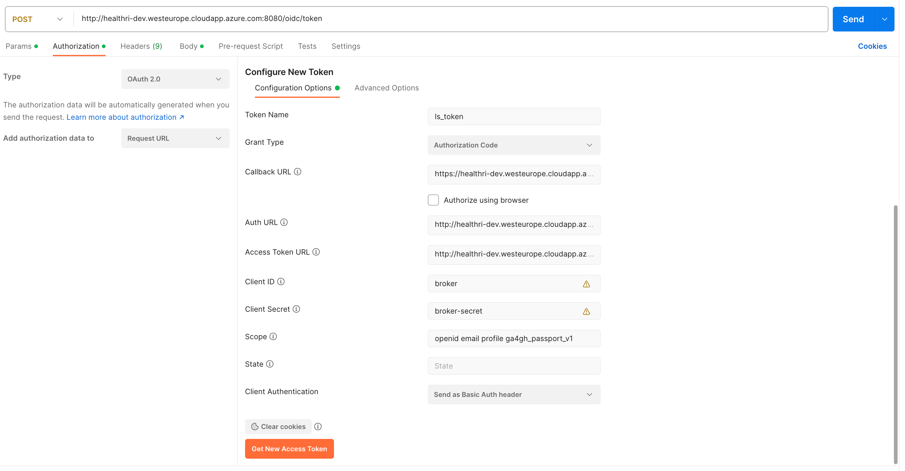

## How to get an LS-AAI token with postman

To get an LS-AAI token one needs to combine two requests: authorisation with client credentials to get an authorisation code and obtaining the token itself.
It is easy to do with Postman.
1. Configure `POST` request to <Ls-AAI>/oidc/token
2. Select type of authorization `OAuth 2.0`
3. Provide the following parameters in Authorization Configuration Options:
   - Token Name - name for your token
   - Grant Type: select `Autorization Code`
   - Callback URL - client call back e.g. `https://healthri-dev.westeurope.cloudapp.azure.com:3001/oidc-callback`
   - Auth URL - LS-AAI auth link e.g. `http://healthri-dev.westeurope.cloudapp.azure.com:8080/oidc/authorize`
   - Access Token URL - LS-AAI token URL, same as the request URL e.g. `http://healthri-dev.westeurope.cloudapp.azure.com:8080/oidc/token`
   - Client ID - as registered in LS-AAI
   - Client Secret - as registered in LS-AAI
   - Scope - scope for the token, in order to work with visa issuers should be `openid email profile ga4gh_passport_v1`
   - Client Authentication: select `Send as Basic Auth header`

Once the request is sent you'll be redirected to browser to consent authentication as a user and then tokens will be issued.