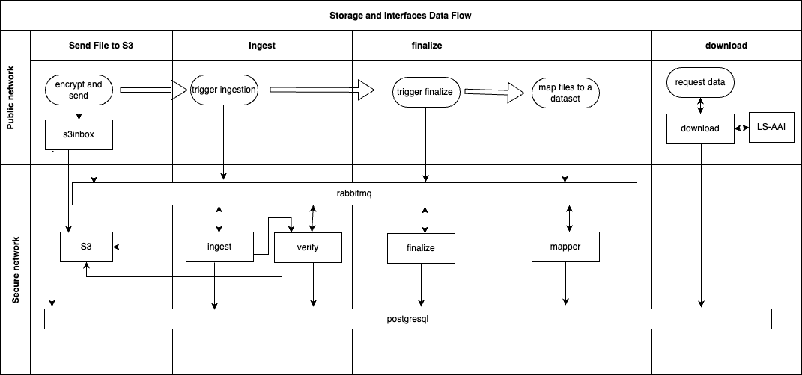

## Storage and Interfaces Loading Data Flow

This document describes steps to upload a file to `storage and interfaces` component from host machine, outside the container.

The flow is summarized on the following schema:


1. Install `crypt4gh` utility as per [instruction](https://github.com/neicnordic/crypt4gh) 
2. Install [s3cmd client](https://s3tools.org/s3cmd)
3. Copy sda encryption public key:
```shell
docker cp ingest:/shared/c4gh.pub.pem .
```
4. Encrypt file with `crypt4dg`:
```shell
crypt4gh encrypt -f <file-to-encrypt> -p <sda-c4gh-public-key>
```
5. Prepare config

    5.1 You can fill in the following template:
    ```yaml
    [default]
    access_key = <USER_LS-AAI_ID>
    secret_key = <USER_LS-AAI_ID>
    access_token=<JW_TOKEN>
    check_ssl_certificate = False
    check_ssl_hostname = False
    encoding = UTF-8
    encrypt = False
    guess_mime_type = True
    host_base = <S3_INBOX_DOMAIN_NAME>
    host_bucket = <S3_INBOX_DOMAIN_NAME>
    human_readable_sizes = true
    multipart_chunk_size_mb = 50
    use_https = True
    socket_timeout = 30
    ```
    or copy configuration file from `auth` and edit it afterward:
    ```shell
    docker cp auth:/shared/s3cmd.conf
    ```
    5.2 Get JWK token for the target user and put it into `s3cmd.conf`.

6. Calculate 256-bit and md5 checksums of a file name:
```shell
export ENC_SHA=$(sha256sum "<file_name>.c4gh" | cut -d' ' -f 1)
export ENC_MD5=$(md5sum "<file_name>.c4gh" | cut -d' ' -f 1)
```
7. Send file to s3:
```shell
s3cmd -c s3cmd.conf put <path-to-file.c4gh> s3://<USER_LS-AAI_ID>/<target-path-to-file.c4gh>
```
e.g.:
```shell
s3cmd -c ./s3cfg put NA12878.bam.c4gh s3://azureuser/NA12878.bam.c4gh
```
If successful you will see the following message: 
```shell
upload: 'NA12878.bam.c4gh' -> 's3://azureuser/NA12878.bam.c4gh'  [1 of 1]
 15242998 of 15242998   100% in    0s    51.53 MB/s  done
```
Behind the scene `s3inbox` component checks user identity, validates token, generates target `s3` path (`s3:data/inbox/azureuser/NA12878.bam.c4gh` in our example),
and passes the file to s3. A file ID is assigned to a file and checksum is calculated, the file is registered in the database. `rabbitmq` guides communication between `s3inbox`, `s3` and database.
A record is inserted into `postgres` `sda.files` table:
```commandline
lega=# select * from sda.files;
                  id                  | stable_id | submission_user |    submission_file_path    | submission_file_size | archive_file_path | archive_file_size | decrypted_file_size | backup_path | header | encryption_method | created_by | last_modified_by |          created_at           |         last_modified         
--------------------------------------+-----------+-----------------+----------------------------+----------------------+-------------------+-------------------+---------------------+-------------+--------+-------------------+------------+------------------+-------------------------------+-------------------------------
 1a67005c-bf95-4965-b62e-2f5ef319a281 |           | azureuser       | azureuser/NA12878.bam.c4gh |                      |                   |                   |                     |             |        | CRYPT4GH          | inbox      | inbox            | 2023-10-31 09:52:08.543693+00 | 2023-10-31 09:52:08.543693+00
(1 row)
```

8. Get correlation id from upload message of `rabbitmq`:
```shell
    CORRID=$(
        curl -s -X POST \
            -H "content-type:application/json" \
            -u test:test http://localhost:15672/api/queues/gdi/inbox/get \
            -d '{"count":1,"encoding":"auto","ackmode":"ack_requeue_false"}' | jq -r .[0].properties.correlation_id
    )
```
(!) Note: here and further `localhost` should be `rabbitmq` if run inside docker.

The whole payload message looks like this:
```json
[{"payload_bytes":218,"redelivered":false,"exchange":"sda","routing_key":"inbox","message_count":0,"properties":{"correlation_id":"1a67005c-bf95-4965-b62e-2f5ef319a281","delivery_mode":2,"content_encoding":"UTF-8","content_type":"application/json"},"payload":"{\"operation\":\"upload\",\"user\":\"azureuser\",\"filepath\":\"azureuser/NA12878.bam.c4gh\",\"filesize\":15242998,\"encrypted_checksums\":[{\"type\":\"sha256\",\"value\":\"7cb1555ba8f1f299ebcaa60b60c3bd76dc4cfcd7d2df087766a760e7e1bc1c5e\"}]}","payload_encoding":"string"}]
```

9. Publish message to trigger ingestion
```shell
    properties=$(
        jq -c -n \
            --argjson delivery_mode 2 \
            --arg correlation_id "$CORRID" \
            --arg content_encoding UTF-8 \
            --arg content_type application/json \
            '$ARGS.named'
    )

    encrypted_checksums=$(
        jq -c -n \
            --arg sha256 "$ENC_SHA" \
            --arg md5 "$ENC_MD5" \
            '$ARGS.named|to_entries|map(with_entries(select(.key=="key").key="type"))'
    )

    ingest_payload=$(
        jq -r -c -n \
            --arg type ingest \
            --arg user <user> \
            --arg filepath <user>/"<file_name>.c4gh" \
            --argjson encrypted_checksums "$encrypted_checksums" \
            '$ARGS.named|@base64'
    )

    ingest_body=$(
        jq -c -n \
            --arg vhost test \
            --arg name sda \
            --argjson properties "$properties" \
            --arg routing_key "ingest" \
            --arg payload_encoding base64 \
            --arg payload "$ingest_payload" \
            '$ARGS.named'
    )

    curl -s -u test:test "http://localhost:15672/api/exchanges/gdi/sda/publish" \
        -H 'Content-Type: application/json;charset=UTF-8' \
        -d "$ingest_body"
```
Publishing procedure includes `ingest` connecting to database, receiving a message with file information, decrypts first data block, writes archived file to `s3` archive and
pings `verify` component. `verify` performs some checks, modifies files record in postgres, and removes initial file from `s3` inbox.
`sda.files` record modified by both `ingest` and `verify`:
```commandline
lega=# select * from sda.files;
                  id                  | stable_id | submission_user |    submission_file_path    | submission_file_size |          archive_file_path           | archive_file_size | decrypted_file_size | backup_path |                                                                                                                          header                                                                                                                          | encryption_method | created_by | last_modified_by |          created_at           |         last_modified         
--------------------------------------+-----------+-----------------+----------------------------+----------------------+--------------------------------------+-------------------+---------------------+-------------+----------------------------------------------------------------------------------------------------------------------------------------------------------------------------------------------------------------------------------------------------------+-------------------+------------+------------------+-------------------------------+-------------------------------
 1a67005c-bf95-4965-b62e-2f5ef319a281 |           | azureuser       | azureuser/NA12878.bam.c4gh |                      | 927c7d5a-1a02-45c2-9e54-8d5ed74f57b0 |          15242874 |            15236350 |             | 637279707434676801000000010000006c00000000000000b22df5c77412d23ac2c15346b47ca758a17fae41a6ffe8195d3f14f85316c1455e4dbf7bcea4b1435772772141a0a4f1dd94117b955c9c5fd59a4edb7883e6473c5b74e06a49e1a9b894945c26bc3a46003c0b1134ca4425dd945982ba660b035d4be532 | CRYPT4GH          | inbox      | verify           | 2023-10-31 09:52:08.543693+00 | 2023-10-31 10:01:28.212398+00
(1 row)
```

Ingestion can take some time. To check the status run
```shell
curl -s -u test:test http://localhost:15672/api/queues/gdi/verified | jq -r '."messages_ready"'
```
"messages ready" autoincrements and should be equal to 1 if you load one file at once.

10. Finalize publishing:
```shell
decrypted_checksums=$(
        curl -s -u test:test \
            -H "content-type:application/json" \
            -X POST http://localhost:15672/api/queues/gdi/verified/get \
            -d '{"count":1,"encoding":"auto","ackmode":"ack_requeue_false"}' | jq -r '.[0].payload|fromjson|.decrypted_checksums|tostring'
    )

    finalize_payload=$(
        jq -r -c -n \
            --arg type accession \
            --arg user <user> \
            --arg filepath <user>/"$file.c4gh" \
            --arg accession_id <file accession id> \
            --argjson decrypted_checksums "$decrypted_checksums" \
            '$ARGS.named|@base64'
    )

    finalize_body=$(
        jq -c -n \
            --arg vhost test \
            --arg name sda \
            --argjson properties "$properties" \
            --arg routing_key "accessionIDs" \
            --arg payload_encoding base64 \
            --arg payload "$finalize_payload" \
            '$ARGS.named'
    )

    curl -s -u test:test "http://localhost:15672/api/exchanges/gdi/sda/publish" \
        -H 'Content-Type: application/json;charset=UTF-8' \
        -d "$finalize_body"
```
where `accession_id` is a stable id associated with the file, in current examle we used `EGAF74900000001` (see database record below).

As result of the execution `finalize` associates accession id with files and confirms file delivery.

Resulting `postgres` `sda.files` record:
```commandline
lega=# select * from sda.files;
                  id                  |    stable_id    | submission_user |    submission_file_path    | submission_file_size |          archive_file_path           | archive_file_size | decrypted_file_size | backup_path |                                                                                                                          header                                                                                                                          | encryption_method | created_by | last_modified_by |          created_at           |         last_modified         
--------------------------------------+-----------------+-----------------+----------------------------+----------------------+--------------------------------------+-------------------+---------------------+-------------+----------------------------------------------------------------------------------------------------------------------------------------------------------------------------------------------------------------------------------------------------------+-------------------+------------+------------------+-------------------------------+-------------------------------
 1a67005c-bf95-4965-b62e-2f5ef319a281 | EGAF74900000001 | azureuser       | azureuser/NA12878.bam.c4gh |                      | 927c7d5a-1a02-45c2-9e54-8d5ed74f57b0 |          15242874 |            15236350 |             | 637279707434676801000000010000006c00000000000000b22df5c77412d23ac2c15346b47ca758a17fae41a6ffe8195d3f14f85316c1455e4dbf7bcea4b1435772772141a0a4f1dd94117b955c9c5fd59a4edb7883e6473c5b74e06a49e1a9b894945c26bc3a46003c0b1134ca4425dd945982ba660b035d4be532 | CRYPT4GH          | inbox      | finalize         | 2023-10-31 09:52:08.543693+00 | 2023-10-31 13:42:46.147594+00
(1 row)

```

11. Assign file to dataset (example with 2 files):
```shell
mappings=$(
    jq -c -n \
        '$ARGS.positional' \
        --args <file 1 accession id> \
        --args <file 2 accession id>
)

mapping_payload=$(
    jq -r -c -n \
        --arg type mapping \
        --arg dataset_id <dataset id> \
        --argjson accession_ids "$mappings" \
        '$ARGS.named|@base64'
)

mapping_body=$(
    jq -c -n \
        --arg vhost test \
        --arg name sda \
        --argjson properties "$properties" \
        --arg routing_key "mappings" \
        --arg payload_encoding base64 \
        --arg payload "$mapping_payload" \
        '$ARGS.named'
)

curl -s -u test:test "http://localhost:15672/api/exchanges/gdi/sda/publish" \
    -H 'Content-Type: application/json;charset=UTF-8' \
    -d "$mapping_body"
```
As a result `mapper` creates a dataset (if not exists) and associates files with it by accession id.

To validate files are there from database side:
```shell
docker exec -it postgres bash
```
Connect to the postgres database:
```shell
psql -h localhost -U postgres lega
```
with password `rootpass` and run the following query
```shell
select datasets.stable_id, files.stable_id, submission_file_path from sda.file_dataset join sda.files on file_id = files.id full join sda.datasets on file_dataset.id = sda.datasets.id;
```
Example result:
```shell
lega=# select datasets.stable_id, files.stable_id, submission_file_path from sda.file_dataset join sda.files on file_id = files.id full join sda.datasets on file_dataset.id = sda.datasets.id;
    stable_id    |    stable_id    |        submission_file_path        
-----------------+-----------------+------------------------------------
 EGAD74900000101 | EGAF74900000001 | azureuser/NA12878.bam.c4gh
                 | EGAF74900000002 | azureuser/NA12878_20k_b37.bam.c4gh
(2 rows)

```
